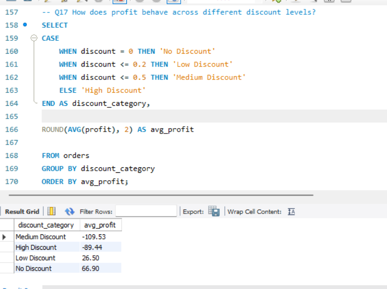
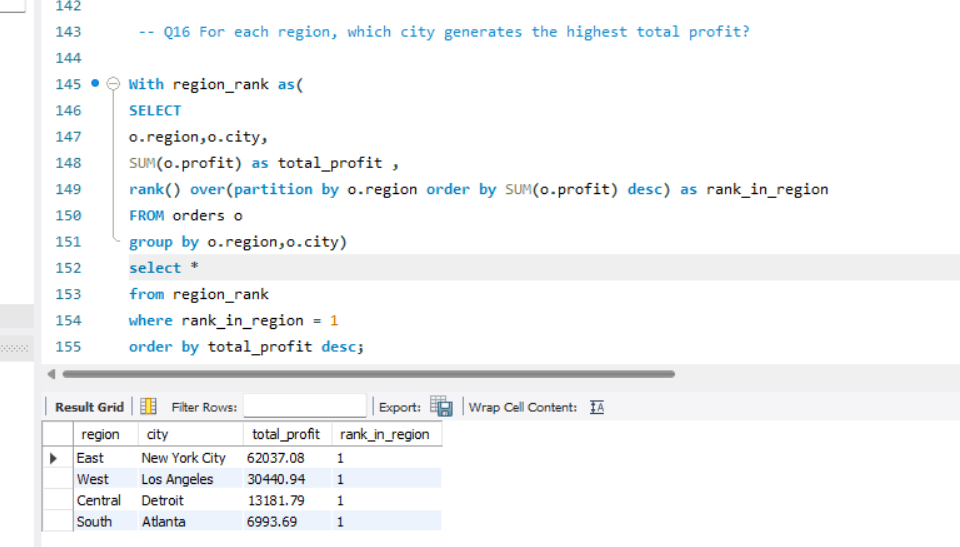
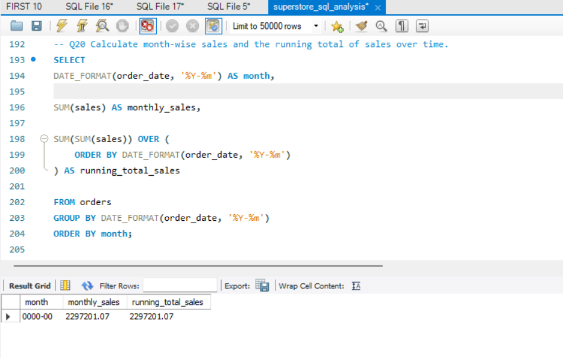

# 📊 Superstore SQL Business Analysis Project

## 📌 Project Overview
This project analyzes the Superstore dataset using MySQL to extract meaningful business insights related to sales performance, profitability, customer behavior, discount impact, and regional trends.

The goal of this project was to practice real-world SQL business analysis by solving practical business questions.

---

## 🛠 Tools Used
- MySQL Workbench
- SQL (Aggregation, Window Functions, CTEs)
- Superstore Dataset

---

## 📊 Key Business Questions Solved
1. What are total sales, profit, and orders?
2. Which categories and products generate the highest revenue?
3. Which customers contribute the most profit?
4. Which regions and states are loss-making?
5. How do discounts affect profitability?
6. What is the running total sales trend over time?

---

## 📈 Key Insights
- Technology category contributes the highest share of revenue.
- Discounts above 20% consistently lead to negative profit.
- Some customers and states generate losses despite high sales.
- West region drives the highest sales performance.
- Running total analysis shows steady business growth over time.

---

## 🧠 Skills Demonstrated
- Data Aggregation & Grouping
- Business KPI Analysis
- Window Functions
- Common Table Expressions (CTEs)
- Profitability Analysis
- Time-Series Analysis

---

## 📂 Files in This Repository
- `superstore_sql_analysis.sql` → Contains all SQL queries used in the project

---

## 🎯 Learning Outcome
This project strengthened my ability to transform raw data into actionable business insights using SQL.

---

## 👨‍💻 Author
**Baibhav Raj**
Aspiring Data Analyst | SQL | Excel | Data Visualization

## 📸 Project Screenshots

### Discount Impact Analysis

### TOP CUSTOMERS

### Most Profitable Cities by Region

### Running Total Sales Trend

